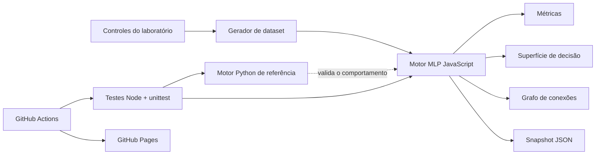

# Arquitetura do Neural IA

## Objetivos

O projeto prioriza quatro propriedades:

1. **Verificável:** o resultado pode ser reproduzido com a mesma seed.
2. **Inspecionável:** não há framework ocultando o forward ou o backpropagation.
3. **Portável:** a experiência principal roda como arquivos estáticos no navegador.
4. **Contribuível:** testes rápidos protegem a matemática e a página.

## Componentes

### Motor web

`web/core/network.js` contém:

- gerador pseudoaleatório determinístico;
- camada densa;
- ativações `tanh`, `relu` e `sigmoid`;
- forward pass;
- backpropagation amostra a amostra;
- snapshot serializável.

O motor não acessa DOM, rede ou armazenamento. Isso permite testá-lo isoladamente.

### Aplicação

`web/app.js` coordena controles, treinamento por frames, métricas e canvas. O treino é dividido entre chamadas de `requestAnimationFrame` para evitar bloquear a interface.

### Motor Python

`python/neural_ia/network.py` espelha a arquitetura em código que usa somente a biblioteca padrão. Ele serve como referência independente e CLI reproduzível, não como backend do site.

### Persistência

O site não mantém dados em servidor. A exportação cria um arquivo JSON local com:

- formato e data;
- dataset e métricas;
- seed e número de épocas;
- pesos e vieses das duas camadas.

O snapshot é material de inspeção, não um artefato assinado. Consumidores devem validar seu esquema antes de confiar nele.

## Segurança e privacidade

- Nenhum dado de entrada sai do navegador.
- Nenhum token é necessário no cliente.
- O único fetch externo consulta contadores públicos do repositório; uma falha não afeta o laboratório.
- A Content Security Policy pode ser endurecida em uma futura versão quando as fontes forem hospedadas localmente.
- O Service Worker armazena somente o app shell público.

## Decisões intencionais

### Sem framework web

O app é pequeno, não precisa de hidratação nem roteamento. JavaScript nativo reduz supply chain, tempo de build e barreira para contribuidores.

### Sem inferência remota

Uma página estática não consegue esconder credenciais. Toda inferência central acontece localmente; integrações futuras com serviços externos devem usar backend separado e consentimento explícito.

### Sem pesos grandes no Git

Modelos baixados e ambientes virtuais são ignorados. Se um experimento futuro precisar distribuir pesos, use um registry adequado e documente licença, hash e origem.
